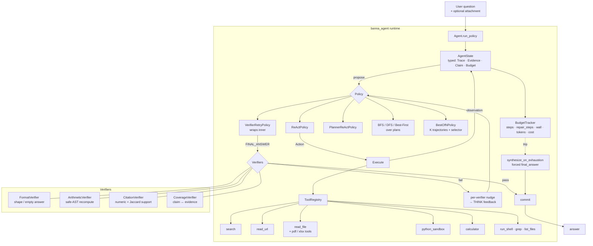

# banna

A from-scratch, provider-agnostic reasoning agent with a **typed state substrate** and a **verifier-guided** loop. Built to study where ReAct-style agents fail on the **GAIA** benchmark and to fix those failures structurally — not with prompt patches.

No LangChain, no LlamaIndex, no smolagents in the core. The reasoning loop is a typed transition function over `(state, action, observation) → state'`; ReAct, verifier-retry, planner-ReAct, BFS/DFS/best-first-over-plans, and best-of-N are each ~200 LOC `Policy` implementations over that same substrate.

## What's interesting about this repo

1. **Forensic GAIA debugging.** A full-validation run on `gpt-5-nano` was instrumented end-to-end, traces were dumped per task, and seven distinct structural failure modes were diagnosed and fixed — not by prompt-tweaking, but by changing the loop. See [Failure modes & fixes](#failure-modes--fixes-the-c1c6-pass) below.
2. **Multi-axis budget tracker** that separates *productive* steps from *repair* steps. A model stuck in an `[empty_reply]` loop no longer burns its productive-step budget; instead it trips a separate `max_repair_steps` axis with a forced tool-choice escape.
3. **Per-verifier actionable nudges.** Each verifier (Arithmetic, Citation, Coverage, Format) attaches a `meta["nudge"]` to its fail verdicts that names the missing thing (the recomputed value, the missing evidence_id, the unsupported number, the empty field). The retry policy groups these by verifier and emits one line per kind — short enough that the model actually reads them.
4. **Budget-exhaustion synthesis.** When the agent runs out of steps mid-task, instead of returning `null`, a final forced-`final_answer` call gives it one last shot with a cheap fallback chain (last claim → last short text → none).
5. **Provider-agnostic tool forcing.** A single helper translates "force any tool" into OpenAI's `tool_choice: "required"`, Anthropic's `{type: "any"}`, and Gemini's `ANY` mode — used to break out of empty-reply loops.

## Architecture



## Quickstart

```bash
git clone https://github.com/<you>/banna.git
cd banna
python -m venv .venv && source .venv/bin/activate
pip install -e ".[dev]"

# set at least one provider key
cp .env.example .env
$EDITOR .env   # OPENAI_API_KEY=... (and/or ANTHROPIC_API_KEY=...)

# run the CLI on a single question
python -m banna_agent.cli.app --policy react --provider openai --model gpt-5-nano

# or run one GAIA Level-1 question
python -m banna_agent.benchmarks.gaia.runner \
    --policy verifier_retry --provider openai --model gpt-5-nano \
    --level 1 --n 1
```

The full GAIA validation runner (165 questions across L1/L2/L3) is in `experiments/02_gaia_full/run.py`.

## Failure modes & fixes (the C1–C6 pass)

Diagnosed from a full GAIA validation run on `gpt-5-nano`. Each fix lands as a structural change to the loop, with unit tests pinning the new behavior.

| ID | Failure mode | Root cause | Fix |
|----|--------------|------------|-----|
| C1 | `[empty_reply]` loops eat the step budget | Repair-style THINKs counted as productive steps | New `Budget.repair_steps_used` axis + `max_repair_steps=6`; `meta["repair"]=True` routes off the main counter |
| C2 | Model returns empty content + no tool call | No detection / no escape | After 2 consecutive empties with no evidence, force `tool_choice` to any tool (provider-agnostic) |
| C3 | `pred_answer=null` on budget exhaustion | Loop exits with no commit | `policy.synthesize_on_exhaustion(state)`: one threaded LLM call with forced `final_answer` + cheap fallback chain |
| C4 | L1 step cap too tight (8 steps) | Default budget profile | L1/L2/L3 caps bumped to 12/18/24 |
| C5 | Rich file tools never used on attachments | Hint steered model toward `read_file` even for PDF/XLSX | Extension-routed `_file_hint()` + cheap `_file_summary()` (pypdf page count, openpyxl sheet names, CSV header) |
| C6 | Verifier retries low repair rate | Feedback was generic | Each verifier populates `meta["nudge"]` with a verifier-specific actionable instruction; retry feedback groups by verifier |

## GAIA validation results

> The fixes are landed and tested (562 tests passing in this public repo, 568 in the private superset). The post-fix re-run on GAIA validation is the next thing on the queue.

| Run | Provider · model | Policy | Set | Accuracy | Notes |
|-----|------------------|--------|-----|----------|-------|
| Pre-C1–C6 | OpenAI · `gpt-5-nano` | verifier_retry | GAIA val (165 Q) | **33.9 %** (56 / 165) | $0.94, 7 structural bugs surfaced |
| Post-C1–C6 | OpenAI · `gpt-5-nano` | verifier_retry | GAIA val (165 Q) | _re-run pending_ | target ≥ 40 % |
| Post-C1–C6 | OpenAI · `gpt-5-nano` | best_of_n (K=3) | GAIA val (165 Q) | _re-run pending_ | stretch ≥ 45 % |

(Numbers populate once the re-run completes; CI is wired to gate on a held-out smoke subset.)

## Repo layout

```
src/banna_agent/
├── core/          AgentState, Trace, Action, Budget, EventLog, run_policy
├── llm/           provider-agnostic LLMClient + adapters (anthropic, openai, gemini, ollama, bedrock)
├── tools/         search, read_url, read_file, pdf/xlsx tools, python_sandbox,
│                  calculator, run_shell, grep, list_files, plan, memory, final_answer
├── policies/      react, planner_react, verifier_retry, bfs/dfs/best_first_over_plans, best_of_n
├── verifiers/     arithmetic, citation, coverage, format, command (+ base protocol)
├── benchmarks/    gaia/ (loader, runner, scorer, report)
├── memory/        in_memory_store, jsonl_store, skill_library, embeddings
└── cli/           Rich-based REPL: /policy /budget /show /skills /compact /save /load …
```

Tests live in `tests/` and are organized to mirror `src/`. Run them with:

```bash
pytest -q
```

Current status: **562 passed, 0 failed** on this public branch (no external substrate dependencies).

## License

MIT
